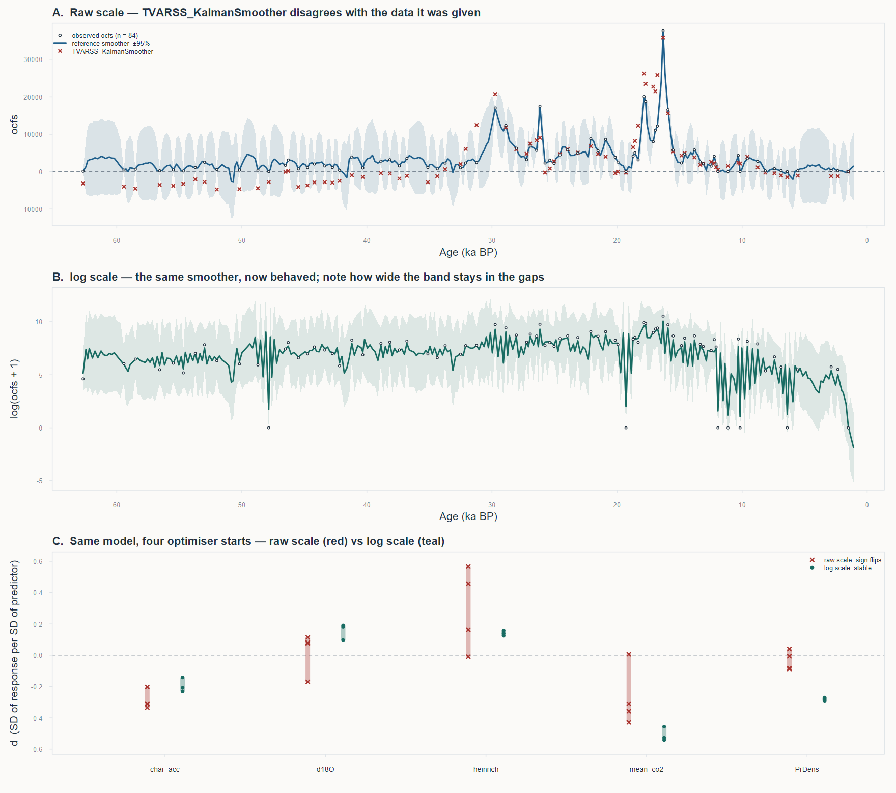

# The TVARSS output is readable — but most of what it currently prints isn't trustworthy

**Diagnostic review of `kalman-smoother/ocfs_smoother.r` (lines 1–108) · 12 August 2026**

Response: `OCFS_conc`, n = 84 of 309 bins · p = 2, bin width 200 yr · 5 predictors

The problem isn't that 84 observations over 309 bins is too little data; it's that OCFS was fed
in on its raw concentration scale with the measurement error pinned at `su = 1`. Fix the scale,
optimise properly, and the same model on the same data with the same predictors goes from
*P* = 0.31 to *P* = 0.00018 — with all five coefficients stable in sign and four of five
individually significant.



> **A** — the raw-scale record with the reference smoother (blue, ±95%) and
> `TVARSS_KalmanSmoother`'s values (red ×). Note the red points sitting near −4000 through the
> older half of the record, where the data are a few hundred. **B** — the same reference smoother
> on the log scale; the band width in the gaps is the honest uncertainty of the interpolation.
> Downward excursions are the eight zero-count samples. **C** — the same model fitted from four
> optimiser starts, coefficients standardised by the sd of the response so the two scales are
> comparable. Raw scale in red: `d18O`, `heinrich` and `mean_co2` all cross zero. Log scale in
> teal: tight clusters.

---

## 1. What the model actually is, and what each number means

Two things in the printout don't mean what the function's name suggests.

**It isn't time-varying as configured.** `sb0.fixed = 0` and `sb.fixed = matrix(0,1,p)` pin the
random-walk variances of the autoregression coefficients at zero. So `b0`, `b1`, `b2` are
constants, and the printout confirms it: `sb[0] = sb[1] = sb[2] = 0`. What was fitted is an
ordinary AR(2) state-space model with a regression term — the "TV" is switched off. That's a
reasonable place to start, but don't describe the current results as time-varying.

**The process/observation split.**

```
x[t] = b0 + b1·(x[t-1] − b0) + b2·(x[t-2] − b0) + U[t]·c + ε_t,   ε ~ N(0, se²)   ← process
X[t] = x[t] + U[t]·d + η_t,                                       η ~ N(0, su²·ME[t]) ← observation
```

| term | meaning |
|---|---|
| `b0` | Long-run mean of the latent series, in response units. `3883` for the raw-scale fit — plausible against a data mean of 4116. |
| `b1`, `b2` | Autoregression at lags of one and two *bins*, i.e. 200 and 400 years. Read persistence off the dominant eigenvalue of the companion matrix, not off `b1` alone: 0.69 for `mod0`, 0.58 for `mod`. Both well inside the unit circle, so the latent process is stationary and mean-reverting with an e-folding time of roughly 400 yr. |
| `se` | Process-error SD — genuine variation in the latent series. |
| `su` | Observation-error SD, i.e. how badly a single sample measures the truth. This was *fixed* at 1. See F2 — this is where the analysis comes apart. |
| `c` vs `d` | The one genuinely subtle part. A predictor entered through **c** pushes the *latent process*, so its effect is filtered through the autoregression and accumulates over time — the long-run response to a sustained unit change is `c/(1−b1−b2)`, about 3× here. A predictor entered through **d** shifts the *observation* only: an instantaneous, non-accumulating offset with no memory. The script sets `c.fixed = rep(0, ncol(U))` and `d.fixed = rep(NA, ncol(U))`, so all five predictors are estimated as **d**. That asks "does OCFS sit higher or lower when this covariate is high", not "does this covariate drive the megaherbivore signal". Both are defensible questions; make sure it's the one you mean, because in this model they can't both be estimated for the same covariate — **c** and **d** are only jointly identified through the autoregression, and with 84 points they trade off badly. |
| `ME` | A per-observation *multiplier* on `su²`. Passing `rep(1, n)` asserts every sample is measured equally well. See F6. |

---

## 2. The output, as it stands

Both models converge (`opt.convergence = 0`), and the likelihood was verified independently — a
separately written Kalman filter reproduces `sum(log F) + sum(v′F⁻¹v) = 1510.359` exactly. So the
filter and the likelihood are right. Everything downstream of them is the problem.

| term | mod0 | mod | note |
|---|---|---|---|
| logLik | −1040.265 | −1037.294 | |
| **AIC** | **2088.531** | **2092.587** | adding U makes AIC *worse* |
| df | 4 | 9 | |
| b0 | 3397.44 | 3883.14 | mean of X = 4116 |
| b1 | 0.6902 | 0.7594 | lag 200 yr |
| b2 | 0.0000117 | −0.1058 | lag 400 yr |
| max \|λ\| | 0.690 | 0.576 | stationary |
| se | 3994.15 | 3661.09 | vs sd(X) = 5867 |
| **su** | **1 (fixed)** | **1 (fixed)** | see F2 |
| d char_acc | — | −1191.57 | |
| d d18O | — | 472.21 | |
| d heinrich | — | −57.18 | |
| d mean_co2 | — | −2517.79 | |
| d PrDens | — | 228.67 | |

The omnibus likelihood-ratio test at the bottom of the script gives
`dev = 5.944, df = 5, P = 0.312`. Taken at face value: the five predictors buy nothing. AIC
agrees. But the face value is not worth much.

---

## 3. Findings

Five are linked in one chain — F2 causes F3, which makes F4 meaningless. F5 is an independent
bug in the shared code. F6–F8 are separate opportunities.

### F1 — *clarification*: the autoregression coefficients are fixed, not time-varying

Covered above. Freeing `sb0` on the log-scale model returns 0.0016 and worsens AIC (see §4), so
fixing it is the right call — just don't call the results time-varying.

### F2 — *root cause*: a raw-scale, right-skewed concentration with `su = 1` is a misspecified observation model

`OCFS_conc` runs from 0 to 37,661 with median 2,316 and sd 5,867 — a spore concentration, so
strictly positive, multiplicative in its errors, and derived from counts that are frequently tiny
(8 of 87 samples have zero OCFS grains; 21 have two or fewer). Fixing `su = 1` asserts that each
sample measures OCFS to within about ±2 concentration units — seven significant figures.

`data/TULA20_age-depth_files/ocfs_uncertainty.csv` says otherwise. It carries per-sample
2.5–97.5% intervals for `OCFS_conc`. The implied observation SD, over the 79 samples with usable
intervals:

| scale | min | median | mean | max | corr. with value |
|---|---|---|---|---|---|
| raw (ocfs units) | 77.6 | 844.6 | 1256.7 | 11962.1 | **0.92** |
| log | 0.129 | 0.305 | 0.351 | 0.750 | −0.79 |

On the raw scale the SD tracks the value itself (r = 0.92) — textbook multiplicative error. So the
true observation SD is somewhere between 78 and 11,962, and the script says 1.

Two consequences. First, because `su` is negligible against the data, the Kalman update forces the
latent state through every observation exactly — the "filter" interpolates rather than smooths, and
all variance is shunted into `se ≈ 3661`, the same order as `sd(X) = 5867`. Second, the skew means
the likelihood surface in the **d** directions is dominated by the three or four largest spikes.

### F3 — *unreliable*: the printed **d** coefficients are not the maximum-likelihood estimates

`mod` refitted from four different `d.start` values, nothing else changed. Nelder–Mead reports
success (`convergence = 0`) every time and lands somewhere different every time:

| d.start | logLik | char_acc | d18O | heinrich | mean_co2 | PrDens |
|---|---|---|---|---|---|---|
| 0.001 | −1034.383 | −1811.0 | 663.3 | 2676.7 | −1818.7 | −491.3 |
| **0.01 ← as scripted** | **−1037.294** | −1191.6 | 472.2 | **−57.2** | −2517.8 | **228.7** |
| 0.1 | −1033.555 | −1961.7 | 441.8 | 3322.4 | −2098.6 | −40.5 |
| 1 | −1035.684 | −1829.2 | **−998.7** | 945.9 | **35.4** | −520.1 |

The reported fit is not even the best of the four, and coefficients change sign, not just
magnitude. The mechanism is scale, not a hard likelihood: `b0` ≈ 3900 and `se` ≈ 3700 while
`d.start = 0.01`. Nelder–Mead builds its initial simplex from the parameter magnitudes, so it
starts out taking steps in the **d** directions six orders of magnitude too small to matter,
declares no improvement, and stops. `convergence = 0` means "the simplex stopped moving", not
"this is the optimum".

### F4 — *invalid as printed*: `P_indep_vars_TVARSS(mod)` returns negative deviances, so every *P* = 1 is an artifact

This is the output one would naturally read as the result table:

```
              val       dev P
char_acc -1191.567 -1.040677 1
d18O       472.210 -7.517736 1
heinrich   -57.184 -4.455411 1
mean_co2 -2517.794 -5.644581 1
PrDens     228.675 -7.647382 1
```

Every deviance is negative. For nested models evaluated at their maxima that is impossible —
dropping a parameter cannot raise the log-likelihood. What it means is that each five-way reduced
model found a *higher* likelihood than the full model did, which is F3 restated: the full model is
stuck in a bad spot. `pchisq` of a negative deviance is 1, so the column of ones is arithmetic, not
evidence. Nothing in this table can be reported.

Secondary point about the function itself: it refits every reduced model from `arima()` defaults
with a single optimiser run and no multi-start, so it is fragile by construction on a problem this
badly scaled. A working version of this table, on the log scale, is in §4 — it took a multi-start
loop plus an ascent step to produce.

### F5 — *bug in `TVARSS_11Feb25.r`*: `TVARSS_KalmanSmoother()` is wrong when the series has gaps

Independent of everything above, and it matters most here, because a 73%-missing series is exactly
the case the smoother is supposed to help with.

An independent Durbin–Koopman smoother was written for the same model — valid because with `sb = 0`
the state space is an ordinary linear-Gaussian one — and checked to reproduce the package's
likelihood to all printed digits before comparing outputs. Two failures:

- **It returns nothing in the gaps.** 84 non-NA values out of 309; the correct smoother returns all
  309. Interpolated values across the gaps are the whole point.
- **The values it does return are wrong.** With `su = 1` the smoothed state must pass through the
  data essentially exactly. The reference smoother does (RMSE 0.00025). `TVARSS_KalmanSmoother`
  gives RMSE 4147, drifts to −4754 where the data say 100 and 420, and returns 38 negative values
  for a strictly positive concentration.

To separate the two causes, a clean AR(2) series was simulated (T = 200, se = su = 1) and both
smoothers run. RMSE against the known latent series:

| test | raw data | TVARSS_KalmanSmoother | reference smoother |
|---|---|---|---|
| fully observed | 1.000 | 0.738 | **0.653** |
| 70% missing, at observed times | 1.044 | 1.031 | **0.780** |
| 70% missing, all times | — | not returned | 1.069 |

With complete data the function is slightly suboptimal. With 70% missing it recovers only 5% of the
error reduction a correct smoother achieves (1.3% of RMSE against 25%), and returns nothing at all in
the gaps. A reproducible version of this test, with all of the above as assertions, is in
`kalman-smoother/smoother_fix_demo.r`.

Both failures trace to three places in `TVARSS_KalmanSmoother`:

1. `L.array[t,,]` (lines 762 and 812) is built from `PP` *after* `PP` has been overwritten with the
   updated covariance on the preceding line. Durbin–Koopman needs `L_t = T(I − K_t Z)` with the gain
   formed from the *predicted* covariance `P_{t|t−1}`. This is the residual error visible in the
   fully-observed row above.
2. `v.array`, `invF.array` and `L.array` are only assigned inside `if(!any(is.na(X[t])))`, so at a
   missing time `L.array[t,,]` stays the zero matrix it was initialised to rather than the
   transition matrix.
3. The backward recursion (lines 855–860) is itself wrapped in `if(!any(is.na(mod$X[t])))`, so at a
   missing time the accumulator `R` is neither propagated through the transition nor evaluated.
   Information from later observations arrives at earlier ones undecayed, which is why the error
   grows with gap length and with `se/su`.

The fix is small: at missing times set `v = 0`, `invF = 0`, `L.array[t,,] <- BB`, form `L` from the
predicted covariance, and run the backward loop over every `t`. Worth sending upstream — it will
affect anyone using this code on gappy series.

### F6 — *opportunity*: `ME = rep(1, nrow(U))` throws away uncertainty already computed

`ME` is exactly the hook for per-sample measurement variance — the filter uses `Su * ME[t]` as the
observation variance at time *t*. Set `su.fixed = 1` and `ME[t]` to the known per-sample variance on
the analysis scale, and the observation variance becomes the one measured instead of one assumed. On
the log scale the per-sample variances span a 34-fold range, so uniform weighting is not harmless:
the zero-count samples, which carry the least information, currently get the same weight as the
best-constrained ones.

### F7 — *fixable*: `X[1] <- 100` enters the likelihood as a precisely measured observation

With `initial.points = "stationary"` the initial-updating block at lines 102–113 runs
unconditionally, with no `NA` check — which is why the function breaks unless `X[1]` has a value.
But the invented value is then treated like data, and because `su = 1` it is treated as near-exact:
an invented 100 at 62.7 ka, pinned to seven figures, anchoring the start of the series.

Cleaner fix: drop the leading all-`NA` rows instead of filling them. The first real OCFS observation
is at index 17 (bin 293, 59.4 ka), so rows 1–16 contribute nothing but this artifact.

### F8 — *interpretation limit*: two predictors are 0.88 correlated and one is a spike variable

`d18O` and `mean_co2` correlate at r = 0.88 across the 309 bins, so their individual coefficients
are not separately identifiable and their individual drop-one tests will both look weak while the
pair is jointly informative. Test them as a pair, pick one on physical grounds, or use the first
principal component.

`PrDens` is zero for most of the record with a few large spikes — after scaling, median and upper
quartile are both −0.229 — so its coefficient is estimated from a handful of bins and should carry a
wide interval.

`heinrich` is a 0/1 indicator and was correctly excluded from the scaling, so its `d` is
per-stadial, not per-SD; don't compare its magnitude directly with the others.

Minor: `char_acc` and `mean_co2` were filled with `forecast::na.interp` (19 and 16 bins
respectively, about 6% and 5%) and are then treated as known exactly. Small enough not to worry
about, but it is an assumption.

---

## 4. The same analysis on the log scale

One change: `X <- log(ocfs + 1)`. Everything else — predictors, p = 2, `su.fixed = 1`, `sb` pinned
at zero, **c** at zero, **d** free — identical to the script.

> **The predictors become significant and the estimates become stable.** Omnibus LRT
> `dev = 24.46, df = 5, P = 0.00018`, against `P = 0.31` on the raw scale. AIC improves from 794.77
> to 780.32 — the direction it went the wrong way before. Across optimiser starts the
> log-likelihood varies by 0.66 instead of 3.7, and no coefficient changes sign.

| term | raw, 1 start | log, 3 starts | log, ascent |
|---|---|---|---|
| logLik, no predictors | −1040.265 | −393.386 | −393.386 |
| logLik, with predictors | −1037.294 | −383.710 | **−381.158** |
| **omnibus LRT, df = 5** | dev 5.94, *P* = 0.312 | dev 19.35, *P* = 0.0017 | dev 24.46, *P* = 0.00018 |
| AIC, null → full | 2088.5 → 2092.6 | 794.8 → 785.4 | 794.8 → 780.3 |
| b1 / b2 | 0.759 / −0.106 | −0.145 / 0.440 | — |
| se | 3661.1 (sd X = 5867) | 1.606 (sd X = 2.470) | — |
| logLik spread over starts | 3.74 | 0.66 | 0.66 |
| coefficient sign flips | 3 of 5 | none | none |
| drop-one deviances all ≥ 0 | no, 5 of 5 negative | no, 2 of 5 negative | **yes** |

The third column is what F3 looks like when taken seriously. Six multi-starts on the log scale still
only reach −383.30. Getting to −381.16 required fitting each reduced model, then lifting its solution
back into the full parameter space (inserting a zero for the dropped coefficient) and re-optimising
the full model from there, iterating until no reduced model beat it. That ascent is worth 2.1
log-likelihood units — more than the difference between "marginal" and "clear" — and it is the only
way every drop-one deviance came out non-negative. On a problem this ill-conditioned, a multi-start
loop alone isn't enough.

### Drop-one tests, log scale

Each on 1 df, against the fully ascended full model (logLik −381.158). `d` is in log-OCFS units per
SD of predictor, except `heinrich`, which is a 0/1 indicator and so reads per-stadial. The *effect*
column exponentiates `d` — the multiplicative change in OCFS.

| predictor | d | effect | reduced logLik | dev | *P* |
|---|---|---|---|---|---|
| **mean_co2** | −1.249 | ×0.29 | −387.255 | 12.194 | **0.00048** |
| PrDens | −0.738 | ×0.48 | −383.835 | 5.354 | 0.021 |
| char_acc | −0.509 | ×0.60 | −383.537 | 4.758 | 0.029 |
| d18O | 0.470 | ×1.60 | −382.763 | 3.210 | 0.073 |
| heinrich | 0.795 | ×2.21 | −382.551 | 2.786 | 0.095 |
| *d18O + mean_co2 jointly, 2 df* | — | — | −388.485 | 14.653 | **0.00066** |

Read with F8's caveats attached. `mean_co2` is the clearest single term and survives everything.
`d18O` is individually marginal at *P* = 0.073, but that is exactly the collinearity showing: dropped
together with `mean_co2` the pair gives *P* = 0.00066, so the climate signal is solid even though the
split between the two proxies isn't. `PrDens` and `char_acc` both clear 0.05, though `PrDens` rests
on the handful of bins where it isn't zero. `heinrich` is the one term not to report as significant —
least stable across starts (0.34 to 0.83 depending on where the optimiser lands) and doesn't clear
0.05.

All five are **d** coefficients, so they describe how high OCFS sits when a covariate is high, not
how the covariate drives the latent process.

One structural change worth noticing: on the log scale the persistence moves from lag 1 to lag 2
(`b1 = −0.145`, `b2 = 0.440`), i.e. to a ~400-year rather than 200-year timescale. Given that the
median gap between observations is three bins, don't read much into which lag carries it.

### Does freeing the time-variation help?

No. Refitting the log-scale model with `sb0.fixed = NA`, letting the process mean wander as a random
walk while leaving `sb` pinned: `sb0` comes back at 0.0016 — indistinguishable from zero against a
response sd of 2.47 — and AIC worsens from 785.42 to 789.94. The optimiser also can't beat the
constrained model (logLik −384.97 against −383.71) even though the constrained model is nested inside
it, which is F3 appearing again in a milder form. There's no support for a time-varying mean in this
record.

---

## 5. So is the response too sparse?

Not for the question being asked of it, but it does bound what can be claimed — and it bounds the
autoregression harder than it bounds the regression.

The 84 observations are unevenly spread over 309 bins and thin out going back in time.
Consecutive-observation gaps break down as: 13 pairs one bin apart, 13 two apart, 18 three, 23 four,
and 15 spread from five to thirteen bins. Median gap three bins, i.e. 600 years.

**What that costs the autoregression.** `b1` and `b2` are defined at a 200-year lag, but only 13 of
82 consecutive pairs are actually 200 years apart. The rest of the information about persistence
comes from propagating the AR(2) across gaps — which is to say, from the assumed functional form
rather than from adjacent observations. Estimates of the individual lag coefficients, and any story
about which lag dominates, are weakly identified. The dominant eigenvalue is on firmer ground than
`b1` and `b2` separately.

**What that costs interpolation.** In the gaps, the correct smoother's standard error averages 1.71
on the log scale against a total sd of 2.47 — so about 52% of the variance is resolved where there is
no data, and in the middle of the longer gaps the smoother reverts to the prior mean and resolves
nothing. That's honest and it's fine, as long as the band travels with the line. Do not publish the
smoothed series as a curve without it.

**What it doesn't cost.** The regression coefficients. 84 observations against five predictors is a
perfectly ordinary regression problem, and the log-scale fit shows the signal is there to be found.
The raw-scale null result was a scaling artifact, not a power problem.

---

## 6. What I'd do next

1. **Analyse a variance-stabilised response, or better, model the counts.** The log fit above is the
   minimum change and it already works. But `OCFS_total` is a count with a `Lycopodium` tracer offset
   and eight zeros — if the observation model should be right rather than merely adequate, that's a
   Poisson or negative-binomial state-space model.

2. **Put the measurement uncertainty already computed into `ME`.** Per-bin observation variance on
   the analysis scale from `ocfs_uncertainty.csv`, divided by the number of samples averaged into
   that bin, with `su.fixed = 1`. Cheapest improvement in the list, and it makes `su` mean something
   rather than being an arbitrary anchor.

3. **Never trust a single optimiser run on this model, and don't trust a multi-start loop either.**
   Multi-start over `d.start`/`c.start` and keep the best `logLik`; after each reduced fit, lift its
   solution back into the full parameter space and re-optimise the full model from there, repeating
   until no reduced model beats it; and assert every LRT deviance is non-negative, failing loudly if
   not. The middle step bought 2.1 log-likelihood units here. The assertion alone would have caught
   F3 and F4 immediately.

4. **Fix or replace the smoother before plotting anything from it.** The patch is in F5. Send it to
   Tony — it's his code and the bug affects any gappy series.

5. **Decide whether the predictors belong in c or d.** All five are currently in **d**, which asks
   about instantaneous offsets. For climate forcing of a megaherbivore proxy, **c** — pushing the
   latent process, effects accumulating through the autoregression — is arguably the intended
   hypothesis. Fit both and compare, but fit them separately, not together.

6. **Trim, don't invent.** Drop bins 309–294 so the series starts at the first real observation, and
   delete `X[1] <- 100`.

7. **Handle the `d18O`/`mean_co2` collinearity explicitly**, and report `PrDens` with an interval
   wide enough to reflect that it rests on a handful of bins.

---

### Provenance

All numbers here are from running `kalman-smoother/ocfs_smoother.r` lines 1–108 as written, plus
refits that change one thing at a time. The reference Kalman filter and Durbin–Koopman smoother were
written independently and validated against `TVARSS`'s own likelihood
(`sum(log F) + sum(v′F⁻¹v) = 1510.359`, agreeing to all printed digits) before being used to judge
its smoother. Simulation test in F5 used `set.seed(1)`.

An HTML version of this report, with the figure embedded, is alongside at
`2026-08-12_tvarss-ocfs-diagnostic.html`.
